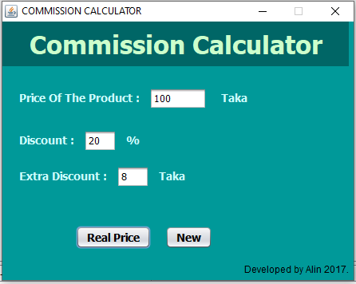

# Commission Calculator - Java Project

A java calculator for windows to calculate simple commission and get actual price of any product.

## Pre-requirement:

<ul>
    <li>Java JDK8, JRE8</li>
</ul>

### Project Version:

1.0.0 (May-2017)

### Start Date:

May-2017

### Target Device and Operating System:

Windows 10 (x86 Bit) supported device.

### Developed by:

Md. Rezwan Saki Alin
https://www.alinsworld.com/

### Used Languages and Tools:

Java JDK8, JRE8, NetBeans8.2 (Using Swing)
